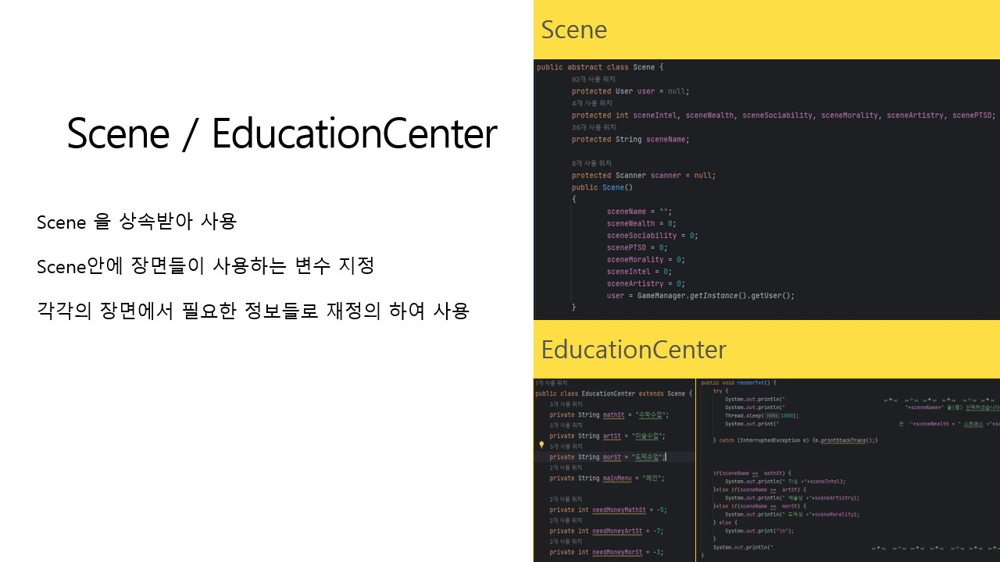

# txtRPG
Java로 제작한 txtRPG
  

## txtRPG 프로젝트
### 1. txtRPG_java
###### 작업 기한  :  9월 13일 ~ 9월 19일

### 2. txtRPG_SQL
###### 작업 기한  :  9월 29일 ~ 10월 6일
java로만 만든 txtRPG에 SQL 구문 추가
  

## txtRPG 작업
### 1. 개발인원 4명 ( 팀프로젝트 작업 )

### 2. 담당역할
- 게임 턴 출력

- Scene / EducationCenter​

- Status

- ImageDisplay

- 발생 이슈 관리

### 3. 작업환경
- Java(JDK 11)
  

## 게임설명
- 게임은 촐 24턴으로 진행되며, 육성 시물레이션 게임입니다.
교육, 아르바이트, 파티, 상점등으로 이동하며 캐릭터의 스텟을 변경시켜 24턴이 완료 되었을때 최종 스텟으로 엔딩이 결정된다.

